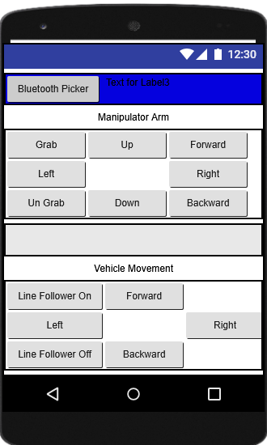

# Line-Follower Robot with 4DOF Arm
Uses an Arduino Uno MCU, a 4DOF acrylic arm, and photodiode, led combo for line following. The arm can be used to lift small objects with its claw.

## Automatic Mode
The robot has an automatic mode and a manual control mode.
In the automatic mode:
1. Picks up/loads an object from its left side
2. Follows the a dark-colored line
3. Unloads the grabbed object to its left side

## Manual Mode
The robot also has a backup manual mode where the robot is controlled from a mobile app. The app connects to the robot using bluetooth. In the app it is possible to control the complete movement of the robot and and arm. It is also possible to enable/disable line follower mode.

